<div align="center">

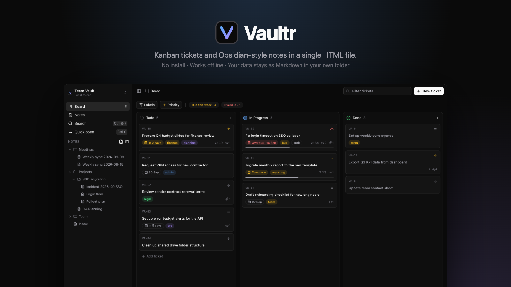

<br>

**Kanban tickets and Obsidian-style notes in a single HTML file.**<br>
No install. Works offline. Your data stays as Markdown in a folder you own.

[](https://github.com/khunfloat/vaultr/actions/workflows/ci.yml)
[](https://github.com/khunfloat/vaultr/releases/latest)
[](LICENSE)

[**Download `vaultr.html`**](https://github.com/khunfloat/vaultr/releases/latest/download/vaultr.html) · [Features](#features) · [Quick start](#quick-start) · [How your data is stored](#your-data) · [Development](#development)

</div>

---

## Why Vaultr?

Vaultr was built for a very ordinary situation: a locked-down work computer where you **can't install anything**, but you still want a proper task board and a real note-taking tool.

- 🧩 **One file.** `vaultr.html` is the whole app — double-click it and it opens in Edge or Chrome.
- 📂 **Plain files, your folder.** Notes and tickets are `.md` files in a folder you pick. Open them in Notepad, VS Code or Obsidian any time.
- ✈️ **Offline and private.** No server, no account, no telemetry, no network requests.
- ⚡ **Jira-style board + Obsidian-style notes** that link to each other.

## Features

### Kanban board

Drag tickets between **Todo / In Progress / Done** and reorder within a column. Cards show priority, deadline (overdue and due-soon are highlighted), labels, checklist progress, links and attachments. Filter by text, label, priority, *due this week* or *overdue*.

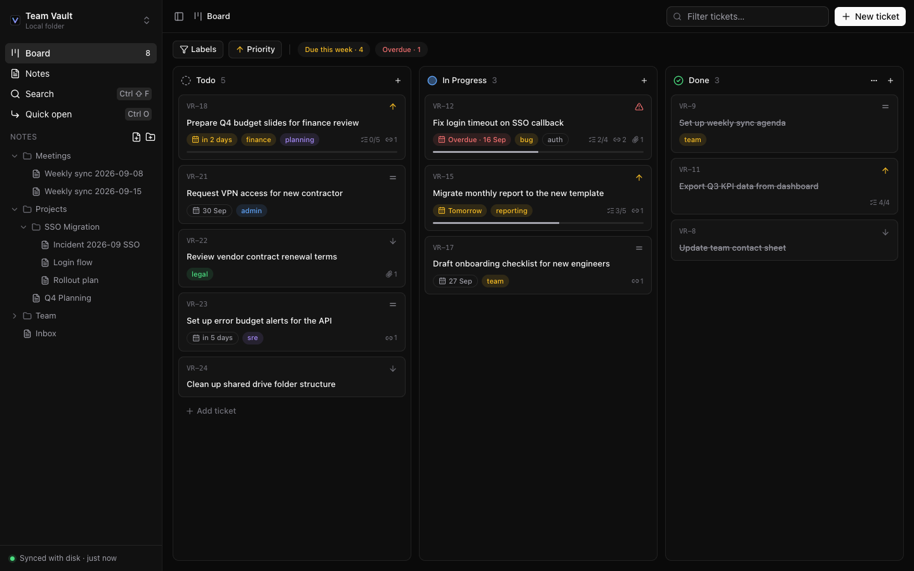

### Jira-style tickets

Open a ticket for a full editor with status, deadline, priority and labels on the side. The description is full Markdown: paste screenshots, drop files, add checklists, logs and `[[links]]` to notes. Linked notes and attachments are listed automatically. Hide the details panel when you want more room.

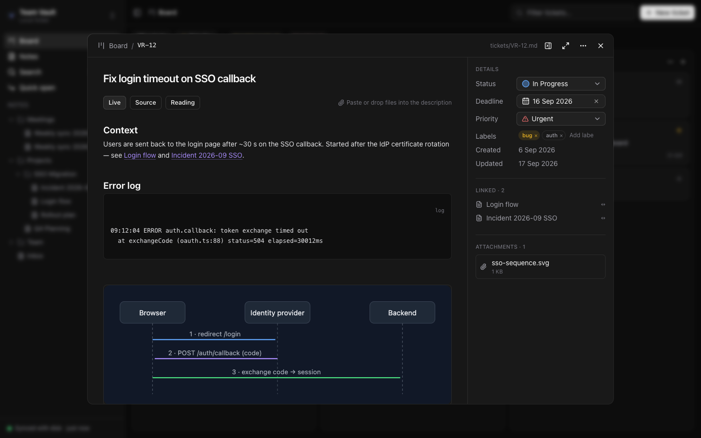

### Notes that feel like Obsidian

A CodeMirror 6 editor with **Live Preview** — formatting renders as you type and the raw syntax appears only on the line you're editing.

- `[[Wikilinks]]` to notes and tickets, with autocomplete; links to missing notes create them
- **Backlinks**, outgoing links, outline and tag panels
- **Properties** editor for YAML frontmatter
- Callouts (`> [!note]`, `[!warning]`, `[!tip]`…), tables, task lists, highlights, code blocks, images and embeds
- Folder tree with drag & drop, **Move to…**, rename (links update everywhere) and a safe trash
- Tabs, plus **Live / Source / Reading** modes

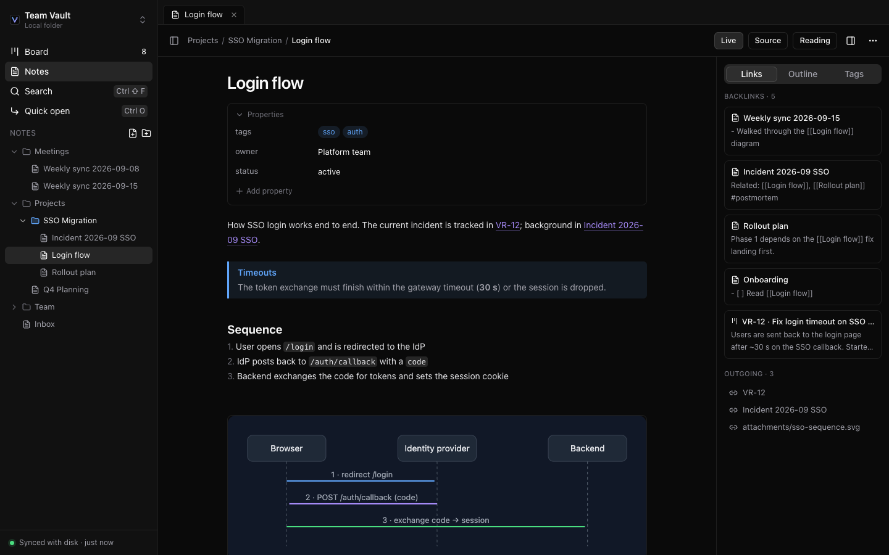

<table>
<tr>
<td width="50%">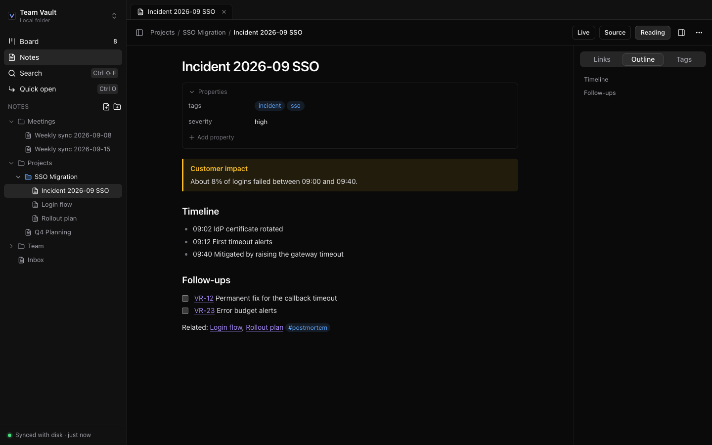<br><b>Reading mode</b> — callouts, task lists, outline</td>
<td width="50%">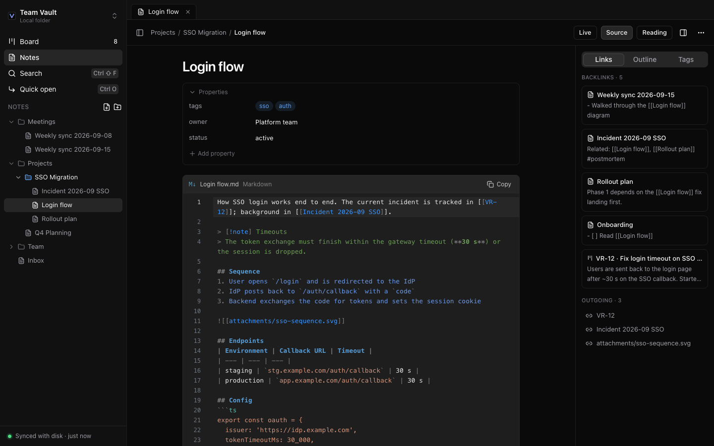<br><b>Source mode</b> — VS Code–style with line numbers and a Copy button</td>
</tr>
</table>

### Slash commands and quick links

Type `/` on any line for a Notion-style block menu: headings, lists, to-dos, quotes, callouts, code blocks, tables, dividers, images, dates and more.

**Web links in three keystrokes:** type `/link`, paste a URL, press <kbd>Space</kbd> — it becomes a clickable chip that opens in a new tab.

<table>
<tr>
<td width="50%">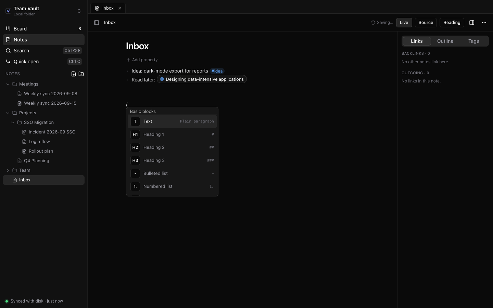<br><b>Slash menu</b></td>
<td width="50%">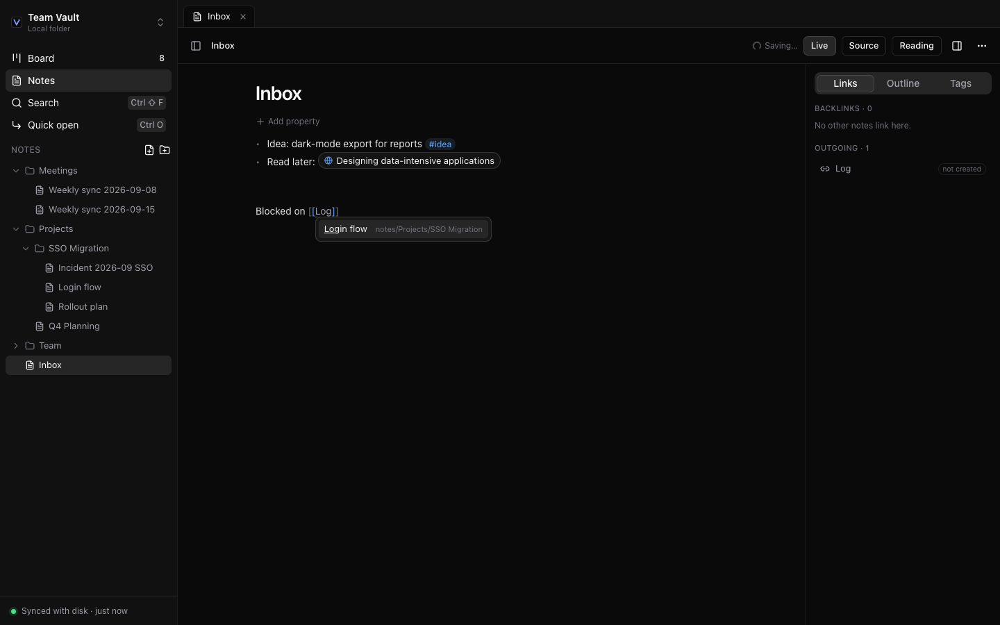<br><b><code>[[</code> autocomplete</b></td>
</tr>
</table>

### Find anything

<kbd>Ctrl</kbd>+<kbd>O</kbd> jumps to any note or ticket. <kbd>Ctrl</kbd>+<kbd>Shift</kbd>+<kbd>F</kbd> searches everything — titles, content, ticket keys and `#tags` — with highlighted snippets. Works with languages that don't use spaces between words (e.g. Thai).

<table>
<tr>
<td width="50%">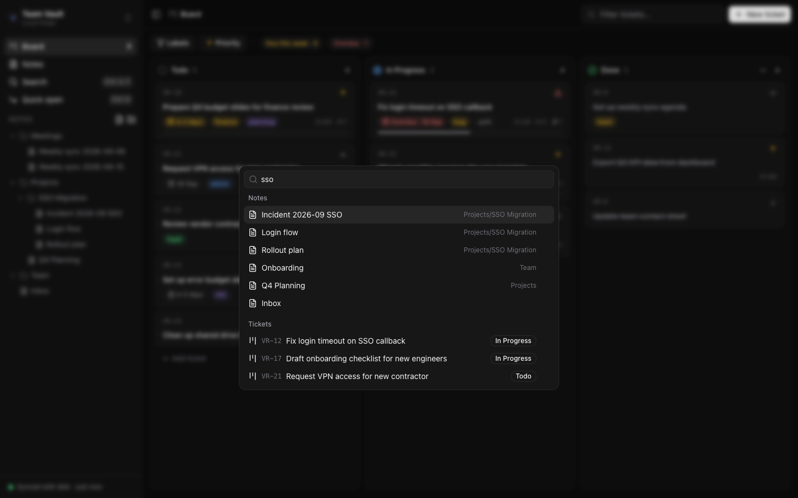<br><b>Quick open</b></td>
<td width="50%">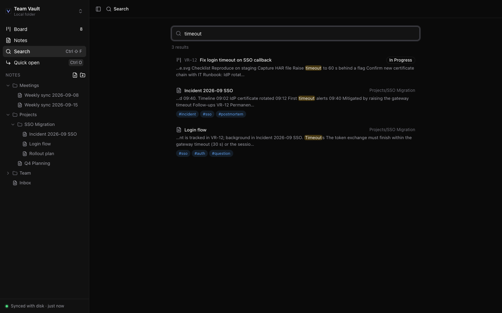<br><b>Full-text search</b></td>
</tr>
</table>

### Safe with your files

- **Autosave** to disk as you type.
- **External edits are detected** — change a file in Notepad or Obsidian and Vaultr reloads it. If you were typing at the same time, you choose *Reload from disk* or *Keep my version*.
- **Nothing is hard-deleted** — deleted notes and tickets go to `.trash/`.
- **Read-only when locked** — cached data stays visible until you reconnect the folder.

## Quick start

1. **Download** [`vaultr.html`](https://github.com/khunfloat/vaultr/releases/latest/download/vaultr.html) and put it somewhere permanent, e.g. `Documents\Vaultr\vaultr.html`.
2. **Create an empty folder** for your data, e.g. `Documents\VaultrData`.
3. **Double-click `vaultr.html`**, click **Choose folder…**, pick the data folder and allow editing.

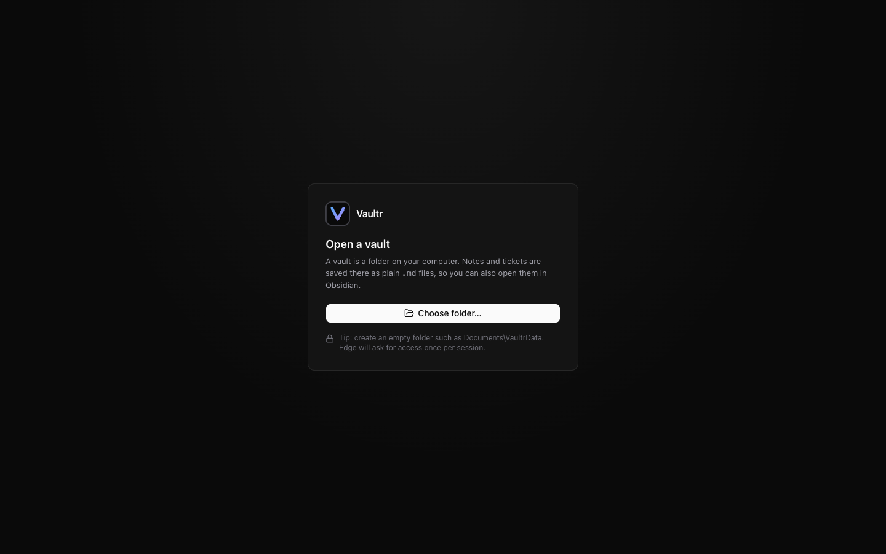

Next time, click **Reconnect vault** once — browsers ask for folder permission once per session. See the full [user guide](docs/USER_GUIDE.md).

### Browser support

| Browser | Supported | Notes |
| --- | :---: | --- |
| Microsoft Edge 100+ | ✅ | Primary target, including `file://` |
| Google Chrome 100+ | ✅ | |
| Other Chromium browsers | ⚠️ | If they ship the File System Access API |
| Firefox, Safari | ❌ | No File System Access API for folders |

## Your data

Everything lives in the folder you choose — Vaultr never uploads anything.

```
VaultrData/
├── notes/              your notes, any folder structure
├── tickets/            one Markdown file per ticket
│   └── archive/        done tickets older than 30 days (optional)
├── attachments/        pasted screenshots and files
├── .vaultr/            app settings (ticket numbering)
└── .trash/             deleted items — move them back to restore
```

A ticket is ordinary Markdown with frontmatter, so it's easy to read, diff, back up or script:

```markdown
---
key: TD-12
title: Fix login timeout on SSO callback
status: in-progress        # todo | in-progress | done
priority: urgent           # urgent | high | medium | low
deadline: 2026-09-15
labels: [bug, auth]
order: a0                  # position within the column
created: 2026-09-11T09:02:00+07:00
updated: 2026-09-17T10:40:00+07:00
---
## Context
Users are sent back to the login page… see [[Login flow]].
```

Unknown frontmatter keys are preserved, and the whole vault opens cleanly in [Obsidian](https://obsidian.md).

## Keyboard shortcuts

| Shortcut | Action |
| --- | --- |
| <kbd>Ctrl</kbd>+<kbd>O</kbd> / <kbd>Ctrl</kbd>+<kbd>K</kbd> | Quick open |
| <kbd>Ctrl</kbd>+<kbd>Shift</kbd>+<kbd>F</kbd> | Search everything |
| <kbd>Ctrl</kbd>+<kbd>Alt</kbd>+<kbd>N</kbd> | New note |
| <kbd>Ctrl</kbd>+<kbd>Alt</kbd>+<kbd>T</kbd> | New ticket |
| <kbd>Ctrl</kbd>+<kbd>B</kbd> | Toggle sidebar |
| <kbd>Ctrl</kbd>+<kbd>/</kbd> | Show shortcuts |
| <kbd>/</kbd> | Block menu (in the editor) |
| <kbd>[[</kbd> | Link to a note or ticket |
| `/link` → paste → <kbd>Space</kbd> | Insert a web link chip |
| <kbd>Ctrl</kbd>+click | Open a note link in a new tab |

## FAQ

<details>
<summary><b>Why do I have to click “Reconnect vault” every time?</b></summary>

Browsers only keep folder access for the current session. Vaultr remembers *which* folder you picked and shows your cached notes and board immediately; one click restores write access.
</details>

<details>
<summary><b>How do I back up my data?</b></summary>

Back up the vault folder like any other folder — copy it, zip it, or keep it in a synced folder such as OneDrive. The browser cache can be cleared safely; nothing is lost.
</details>

<details>
<summary><b>Can I use it with Obsidian at the same time?</b></summary>

Yes. Vaultr watches for file changes and reloads notes that were edited elsewhere, and warns you if both sides changed the same note.
</details>

<details>
<summary><b>Does it send any data anywhere?</b></summary>

No. The build is checked to contain no external scripts, styles or fonts, and the app makes no network requests. The only thing that leaves the page is a web link you click yourself.
</details>

## Development

**Requirements:** Node.js ≥ 20.19, [pnpm](https://pnpm.io) 10, and Microsoft Edge for E2E tests.

```bash
git clone https://github.com/khunfloat/vaultr.git
cd vaultr
pnpm install
pnpm dev                 # http://localhost:5173/?fs=demo  ← in-memory demo vault
```

| Command | Description |
| --- | --- |
| `pnpm dev` | Dev server. Add `?fs=demo` (rich sample) or `?fs=memory` (test fixture) to skip picking a folder |
| `pnpm build` | Type-check and build the single-file app to `dist/vaultr.html` |
| `pnpm test` | Unit tests (Vitest) |
| `pnpm e2e` | End-to-end tests in Microsoft Edge (Playwright) |
| `pnpm lint` / `pnpm typecheck` | Oxlint / TypeScript |
| `pnpm screenshots` | Regenerate the README images from the demo vault |

### Architecture

```
features/  board · notes · search · vault      React views
editor/    CodeMirror 6: live preview, slash menu, autocomplete, link chips
markdown/  frontmatter · link extraction · link resolution · reading-view renderer
services/  tickets · notes (rename + relink) · attachments · file operations
index/     indexer · link graph · full-text search · IndexedDB cache
vault/     VaultFs interface → File System Access API  |  in-memory (tests, demo)
```

- **Storage boundary.** All file access goes through the `VaultFs` interface. The real implementation uses the File System Access API; tests and the demo use an in-memory implementation.
- **Index.** On connect, the vault is scanned and only files whose modification time changed are re-parsed. The index (titles, frontmatter, links, tags, headings) is cached in IndexedDB so the next start is instant.
- **Change detection.** The folder is polled every few seconds and on window focus; edits made by Vaultr update the index directly.
- **Single file.** [`vite-plugin-singlefile`](https://github.com/richardtallent/vite-plugin-singlefile) inlines everything; `scripts/postbuild.mjs` fails the build if anything would load from outside.

**Stack:** React 19 · TypeScript · Vite · Tailwind CSS v4 · shadcn/ui · CodeMirror 6 · markdown-it · dnd-kit · Dexie · Zustand · MiniSearch · Vitest · Playwright

More background in [`docs/DESIGN.md`](docs/DESIGN.md).

## Roadmap

- [ ] Embedded notes (`![[note]]`), footnotes, math (KaTeX) and Mermaid diagrams
- [ ] Split panes and a command palette
- [ ] Graph view, daily notes and templates
- [ ] Custom board columns and ticket prefixes from the UI
- [ ] Light theme

Ideas and PRs are welcome — see [CONTRIBUTING.md](CONTRIBUTING.md).

## License

[MIT](LICENSE) © Chayoot Kositwanich
